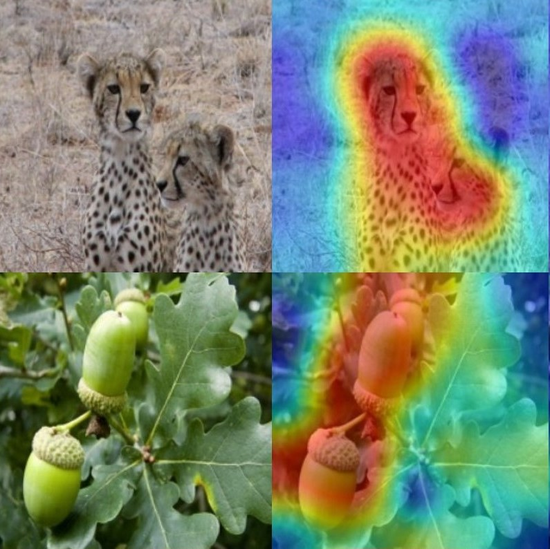

# PyTorch Implementation of Adaptive Baseline Sampling


<p align="center">
  
</p>

## Introduction
This is the official PyTorch implementation of the Adaptive Baseline Sampling (ABS) method.

We introduce a novel method that enables visualization of predictions made by vision models, as well as visualization of explanations for a specific class.
In this method, we present the concept of adaptive baseline sampling.

## Producing ABS Classification Saliency Maps
Images should be stored in the `data\ILSVRC2012_img_val` directory. 
The information on the images being evaluated and their target class can be found in the `data\pics.txt` file, with each line formatted as follows: `<file_name> target_class_number` (e.g. `ILSVRC2012_val_00002214.JPEG 153`).

To generate saliency maps using our method, run the following command:
```
python saliency_map_generator.py
```

The generated saliency maps will be stored in the `qualitive_results` directory.
### ViT models weight files:
- ViT-B [Link to download](https://github.com/rwightman/pytorch-image-models/releases/download/v0.1-vitjx/jx_vit_base_p16_224-80ecf9dd.pth)
- ViT-S [Link to download](https://github.com/rwightman/pytorch-image-models/releases/download/v0.1-weights/vit_small_p16_224-15ec54c9.pth)

## Credits
For comparison, we used the following implementations of code from git repositories:
- https://github.com/jacobgil/pytorch-grad-cam
- https://github.com/PAIR-code/saliency

